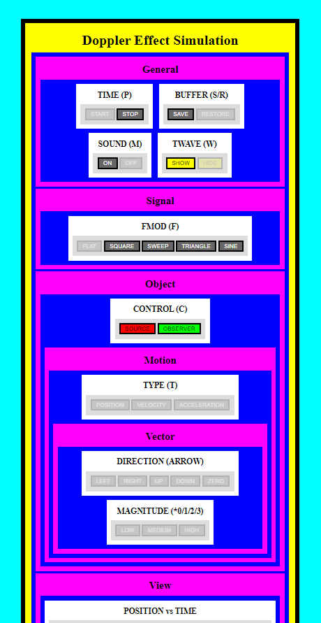

# dopplerJS 🔊
Small visualization of doppler sound effect for Physics 1.

## Controls
Arrow keys - to move the position of the source (only)

## Output
The hue of the source represents the frequency of the sound wave sent.

The hue of the observer represents the frequency of the sound wave received at the time of arrival.

The greater the hue, the higher frequency the sound wave and vice versa.

