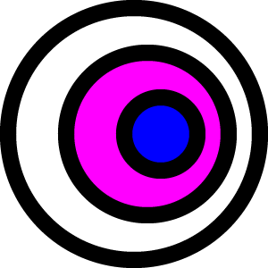
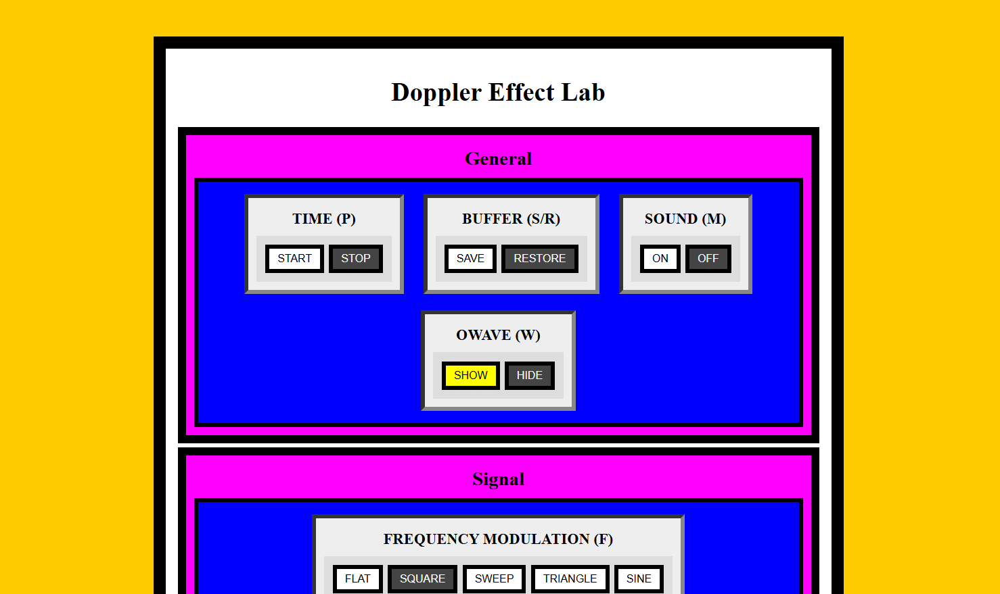
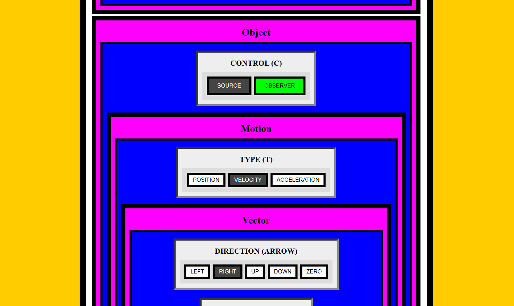

# doppler 🔊

## Logo

## About

Simulation of the doppler effect, particularized in the context of sound waves and explored through scenarios where a wave emitting source and wave detecting observer move with a user controllable position, velocity or acceleration.

## Source

Source is controllable in position, velocity and acceleration and is always in one of three states: stationary, constant velocity or constant acceleration.

Source emits waves with a constant or variable frequency and constant amplitude.

## Waves

Waves propagate in time with their amplitude attenuating exponentially.

Only crests are illustrated in the rendering of waves.

When multiple waves collide, interference is not accounted for at the moment.

## Observer

Observer, similarly, is controllable in position, velocity and acceleration and is always in one of three states: stationary, constant velocity or constant acceleration.

Observer detects a wave at a time and records its perceived frequency and amplitude.

## Algorithm

Data of each wave is stored in a rolling queue array where the array is overwritten progressively in a circular fashion.

When each wave is emitted, the current time, as well as the position and velocity of the source is stored in an object to be used later.

To find which wave is currently being detected by the observer, the program goes through each wave to try to find the closest wave that has passed the observer, if any.

If an observer wave is found, the perceived frequency and amplitude is calculated using the vector position and velocity of the observer as well as the vector position and velocity of the source from the time of wave emission (using the source wave data structure mentioned earlier) to find the components of the projected velocities of the source and observer in the relative direction of the observer and source, respectively.

## Functionality

`TIME` button group can be accessed with key `P` to pause the simulation and possibly change the properties of the source and observer.

`BUFFER` button group can be accessed with keys `S` and `R` to save the current simulation context and restore the saved context.

`SOUND` button group can be accessed with key `M` to interpret the observer signal in time as an audible sound.

`OWAVE` button group can be accessed with key `W` to highlight the properties of the wave that is observed at the current time. This includes but is not limited to, the position and velocity of the source.

`FMOD` button group can be accessed with key `F` to modulate the frequency of the source signal in time.

`CONTROL` button group can be accessed with key `C` to switch between modification of the properties of the source and observer.

`TYPE` button group can be accessed with key `T` to switch between modification of the position, velocity and acceleration of the controlled object.

`DIRECTION` button group can be accessed with keys `ArrowLeft`, `ArrowRight`, `ArrowUp`, `ArrowDown` and `0` to set the direction of the vector (including origin) of the selected motion type of the controlled object.

`MAGNITUDE` button group can be accessed with keys `1`, `2` and `3` to set the magnitude of the vector (excluding origin) of the selected motion type of the controlled object.

## Limitations

Simulation does not implement the effects of wave interference.

Observer can only detect one frequency and amplitude at a time.

## Screenshots

### Main

### View

### Plot

